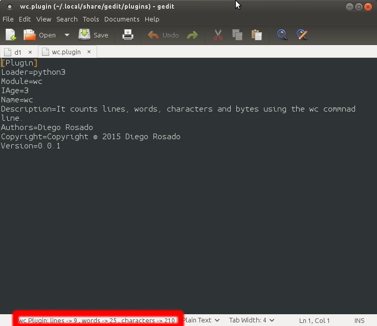

#WC Gedit Plugin
This is a Gedit plugin for know lines, words and characteres a file has.
This plugin uses the ``wc`` command underneath and parse the output to place it in the bottom panel.

## Installation
As all Gedit plugins wc.plugin and wc.py files are expected to be at ``~/.local/share/gedit/plugins/`` folder.

There is plugin taken from https://github.com/footley/gedit-wordcount-plugin to install the plugin easily.
Just run ``./install.sh``

This plugin needs the ``wc`` to be in place to work.

## Usage
Install the plugin, run the Gedit and activate the plugin. From then on whenever you save the file you'll see in the bottom panel a summary of lines, words and characters in the file.

See the screenshot below for a better understanding.

## Contributing
1. Fork it!
2. Create your feature branch: `git checkout -b my-new-feature`
3. Commit your changes: `git commit -am 'Add some feature'`
4. Push to the branch: `git push origin my-new-feature`
5. Submit a pull request :D
